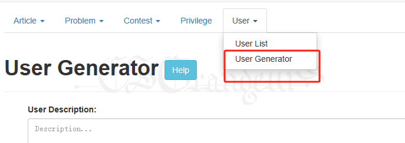
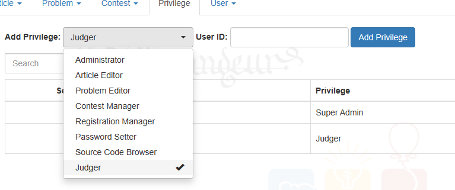

# CSGOJ - 一站式XCPC比赛系统

集成抽签、气球、打印、滚榜

线上版本：https://cpc.csgrandeur.cn/

使用方法见：[用户说明书](doc/user_doc.md)


### 1. 依赖环境

推荐：Ubuntu22.04及以上

也可以 windows11以上 + wsl2 + docker for windows

**部署脚本在 `deploy_files/start_scripts`**

### 2. 试用部署

```bash
cd deploy_files/start_scripts
bash auto_deploy.sh --WITH_JUDGE=1
```

执行完毕后访问 `127.0.0.1:20080`，管理员账号 `admin: 987654321`

### 3. 基本部署

#### 3.1 Web端

```bash
bash auto_deploy.sh \
    --PASS_SQL_ROOT="<数据库root密码>" \
    --PASS_SQL_USER="<数据库业务用户csgcpc的密码>" \
    --PASS_JUDGER="<评测机账号judger的密码>" \
    --PASS_ADMIN="<OJ超级管理员admin的密码>" \
    --PASS_MYADMIN_PAGE="<数据库phpmyadmin的页面访问用户admin的密码>" \
    --PORT_OJ="<自定义OJ Web的端口号>"
```

例如：

```bash
bash auto_deploy.sh \
    --PASS_SQL_ROOT="123456" \
    --PASS_SQL_USER="123456789" \
    --PASS_JUDGER="999999" \
    --PASS_ADMIN="666666" \
    --PASS_MYADMIN_PAGE="333333" \
    --PORT_OJ=80
```

该脚本会自动安装 docker，并部署 mysql、nginx的容器。

如果系统已有docker环境，mysql、nginx服务器，可以仅启动 OJ Web 容器提供 php-fpm 服务，自行在mysql和nginx做相应配置。

```bash
bash start_oj.sh \
    --SQL_HOST="<MySQL IP>" \
    --SQL_USER="<数据库用户名>" \
    --PASS_SQL_USER="<你的数据库密码>" \
    --PASS_ADMIN="666666" \
    --PASS_JUDGER="999999" \
    --PORT_OJ=80
```


#### 3.2 评测机

如果评测机在新环境部署，先安装 docker：

```bash
bash install_docker.sh
```

也可自行参照docker官网安装。

##### 3.2.1 单机多pod

内核多、内存大、硬盘快的高性能评测机使用

```bash
bash batch_sub_judge.sh \
  --OJ_HTTP_BASEURL=<OJ地址> \
  --PASS_JUDGER=<judger的密码> \
  --JUDGER_TOTAL=<启动的pod数>
```

例如

```bash
bash batch_sub_judge.sh \
  --OJ_HTTP_BASEURL=http://url:20080 \
  --PASS_JUDGER=999999 \
  --JUDGER_TOTAL=2
```

建议参数（估算pod个数的方法）： 

满载情况 每个默认pod应有 6个CPU逻辑处理器、6GB可用内存，考虑一般不至于全面满载，也可以相对开多几个pod

##### 3.2.2 单机单pod

性能较差的多台评测机使用

```bash
bash start_judge.sh \
  --OJ_HTTP_BASEURL=http://url:20080 \
  --PASS_JUDGER='999999'
```

##### 3.2.3 多机判题

直接在多个机器分别启pod即可，空闲pod会自行拉取任务。


##### 3.2.4 一些常用的其它定制参数

`JUDGE_USER_NAME`

在web端的后台设置了更多评测账号后，可以给不同评测机使用不同评测账号，便于遇到问题时定位评测机






`JUDGE_SHM_RUN`

如果评测机硬盘较差，可以提供该参数设为 1，让评测机每次复制数据到内存后再执行评测

使用参考：

```bash
# 单机单pod
bash start_judge.sh \
  --OJ_HTTP_BASEURL=http://url:20080 \
  --PASS_JUDGER='999999' \
  --JUDGE_USER_NAME='judger2' \
  --JUDGE_SHM_RUN=1
# 单机多pod
bash batch_sub_judge.sh \
  --OJ_HTTP_BASEURL=http://url:20080 \
  --PASS_JUDGER=999999 \
  --JUDGER_TOTAL=2 \
  --JUDGE_USER_NAME='judger2' \
  --JUDGE_SHM_RUN=1
```

#### 3.3 参数日志

第一次执行脚本后会生成一个配置日志目录 “`config_log`”，如果所有参数都敲定了，可以将满意的配置（形如“`csgoj_config_1698330181.cfg`”的文件）复制到与脚本同一级目录并改名为“`csgoj_config.cfg`”，后续执行脚本可不再输入任何参数，参数的调整也可以直接修改`csgoj_config.cfg`文件。

#### 3.4 注意事项


- Web服务器一定要保证较好的硬件配置
    - 否则出现性能瓶颈时，评测机与Web通讯不佳会导致评测结果出问题。
- 评测机性能没有特殊要求，但和web服务器之间的网络务必通畅
    - 按照上述cpu、内存需求量估算启动的pod数即可，当然还是建议用性能好一点的
    - 任何不符合预期的评测问题，优先考虑评测机数据同步问题，如果不能定位评测机具体数据，可在评测机上直接删评测数据目录（`csgoj_data/var/data/judge-csgoj/data`）并重启judge容器（`docker restart judge-xxxx`）
    - 评测机建议用网线连入网络，不要用wifi，以减少网络波动
- 初始启动时的所有密码（几个”PASS_”开头的参数）建议只用数字字母，以免特殊符号的密码在配置传递中跨系统时识别出错

脚本默认为 latest 版本，如果需要特定版本，可设置 `--CSGOJ_VERSION`参数指定docker镜像版本


### 4. 自行编译及本地部署

```bash
cd deploy_files/build_judge
bash docker_build_base.sh 
cd ../build_php
bash dockerbuild_script.sh
cd ..
bash release.sh build judge web
export CSGOJ_DEV=1
bash auto_deploy.sh <your parameters>
```