# CSGOJ组织XCPC流程

## 1. 比赛流程

左侧菜单栏任意空白位置快速三击鼠标打开管理员登录框，系统账号在此登录。

进入比赛的主页公告区有登录框，比赛内账号在此登录。

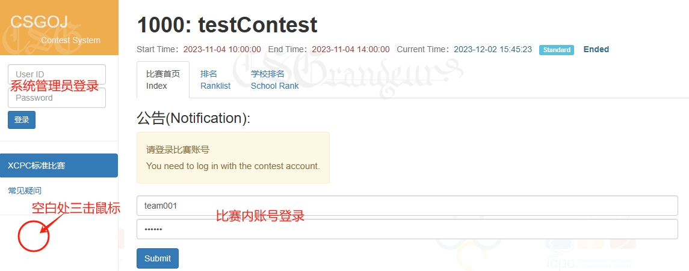

### 1.1 添加比赛

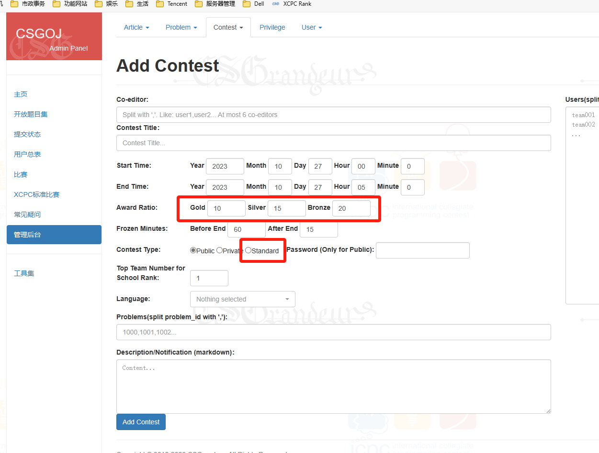

注意勾选比赛类型为 **Standard**

获奖比例（Award Ratio）的功能trick： 

- 设置小于 100 的数视为百分比  
    举例：比如Gold设置 10，表示 10% 的金奖
- 设置大于 100 的数视为按个数设置，个数为 x - 100  
    举例：如果需要定制各奖段的具体个数，可以设置大于 100 的数，
    比如 Gold 设置为 163，系统将识别为 163 - 100 = 63 个金奖。

### 1.2 添加题目

题面为 **markdown + latex** 公式，后台pandoc编译

插图以附件的方式插入，先添加题目后，在修改题目的编辑界面有 **Attach file manager** ，上传图片后使用不带url的路径（点击上传界面的CopyUrl列的按钮可复制路径）插入题面。

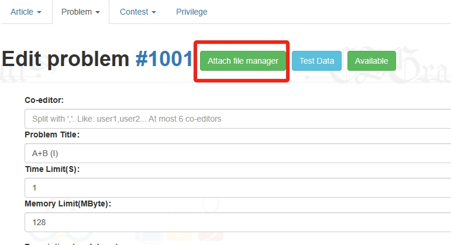

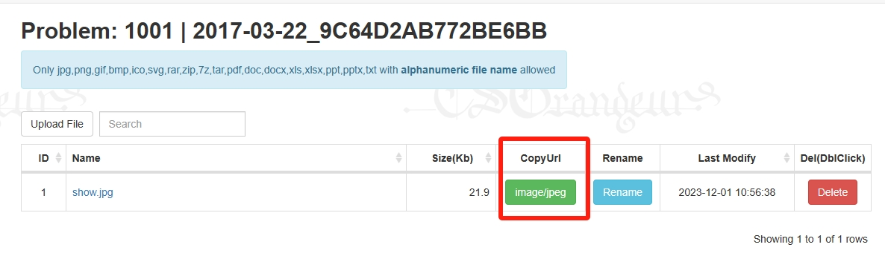

### 1.3 Special Judge

将special judge代码与评测数据一起上传，并勾选题目设置中的“Special Judge”

#### 1) 基于testlib（推荐）

只支持AC和WA的结果，非AC都会处理为WA，上传 tpj.cc 文件（文件名严格为 **tpj.cc** ），评测机会对tpj.cc执行编译

- 文件名为 tpj.cc !
- 文件名为 tpj.cc !
- 文件名为 tpj.cc !

浮点验证参考：

```cpp
#include "testlib.h"
const double eps = 1e-6;
int main(int argc, char* argv[]) {
    registerTestlibCmd(argc, argv);
    double a, r;
    while(!ans.seekEof()) {
        r = ouf.readDouble();
        a = ans.readDouble();
        if (abs(a - r) > eps) {
            quitf(_wa, "expected %.6lf but got %.6lf", a, r);
        }
    }
    quitf(_ok, "answer is %.6lf", a);
}
```

#### 2) 基于OJ原生spj

只支持AC和WA的结果，非AC都会处理为WA，上传 spj.cc 文件（文件名严格为 **spj.cc** ）

**如果使用了tpj.cc，请不要上传spj.cc**

```cpp
#define AC 0
#define WA 1
#include<stdio.h>
#include<math.h>
const double eps = 1e-6;
char dummy[100000];
int main(int argc, char **args){
    FILE * f_in = fopen(args[1], "r"); // 标准输入
	FILE * f_out = fopen(args[2], "r"); // 标准输出
	FILE * f_user = fopen(args[3], "r"); // 用户输出
    
    double oSys, oUser;
    while(fscanf(f_out, "%lf", &oSys) != EOF)
    {
    	if(fscanf(f_user,"%lf",&oUser) != 1) return WA;
    	if(abs(oSys - oUser) > eps) return WA;
    }
    if(fscanf(f_user,"%s",dummy)==1) return WA;
    fclose(f_in);
    fclose(f_out);
    fclose(f_user);
    return AC;
}
```

### 1.4 生成账号

两种方式

#### 第一种：提前编辑好预期的队伍信息，直接在比赛里导入

在 /cpcsys/admin/contest_teamgen?cid=xxxx 中点击“help”查看导入格式

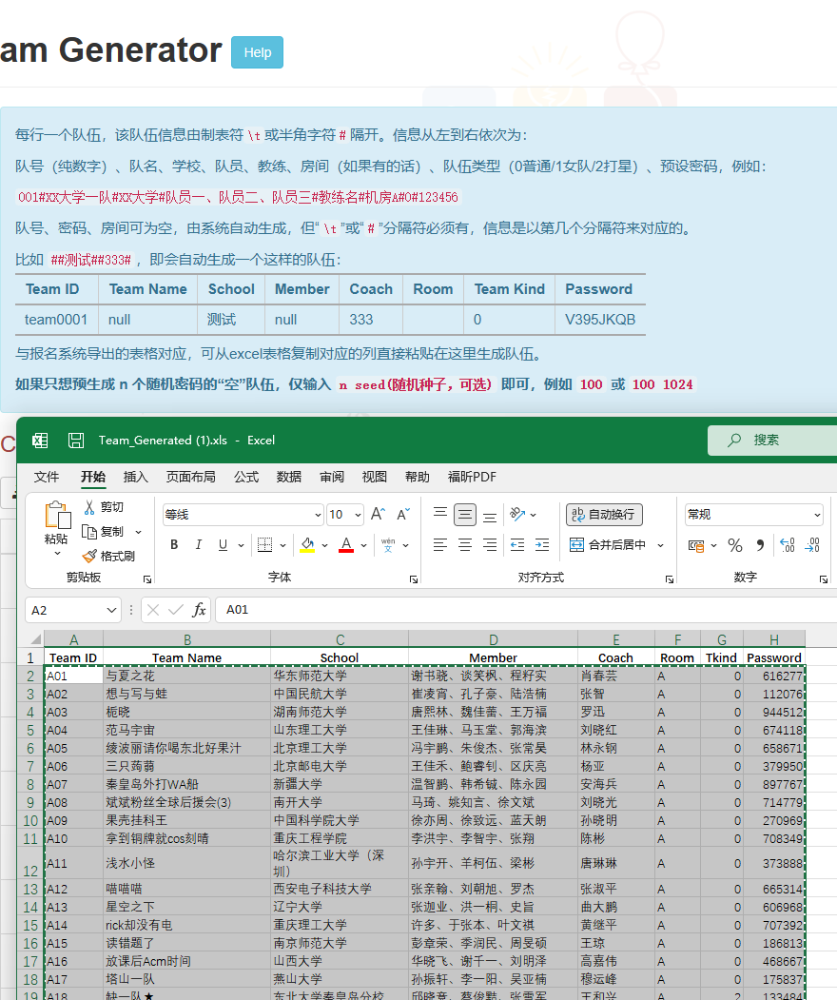


#### 第二种：带抽签环节，抽签后从抽签页面导入

先用双参数生成数量有冗余的、仅有team号和密码的空账号

- 参数1：队伍个数+50（大致冗余）
- 参数2：密码种子数字

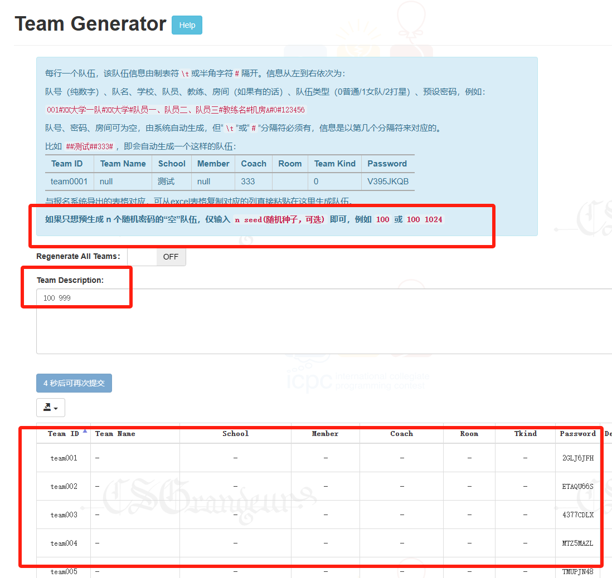
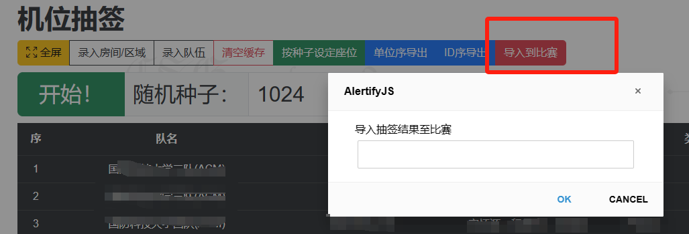


### 1.5 机位抽签

抽签地址：OJ 的 http://[OJ地址]/ojtool/seatdraw 

如果只需抽签不需导入比赛的话，可以不用登录任何账号使用抽签模块

以下以前文通过抽签界面导入账号到比赛的方式为例：

- 承办方按页面提示格式，提前准备好房间、队伍 信息的excel，发管理员一份，承办方、管理员 手上的 excel 务必完全一致
- 承办方于开幕式执行抽签（热身赛前可模拟演练），不用登录任何账号（按钮可找个嘉宾领导来按，有仪式感）
- 承办方将界面上抽签结果的的“随机种子”数字发给管理员
- 管理员登录管理员账号用相同的excel、随机种子抽签获得相同结果，导入到对应比赛
- 承办方“按单位序”导出抽签结果，在网上发布给所有队伍，便于队伍找座位

如果是当天赛前抽签，该流程应提前演练好


### 1.6 封装、分发密码

队伍生成页面在生成队伍后，可点击表格右上XLSX按钮下载密码条打印表，子表提供两种打印模式以及一个用于发布的表。

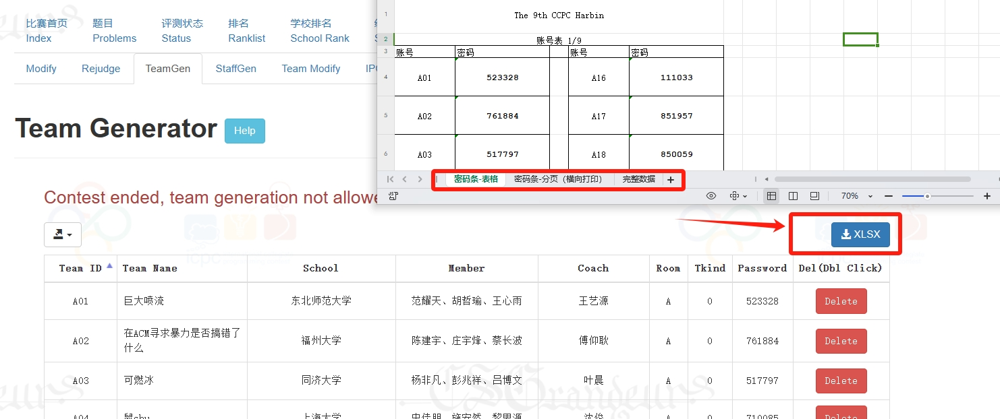

### 1.7 生成工作人员账号

- 承办相关负责人提供 打印员名单、气球员名单，学号+姓名+职责的多列excel为宜
- 管理员在 /cpcsys/admin/contest_staffgen?cid=xxxx 生成工作人员账号
- 管理员另外生成两个裁判（监考员admin）账号，一个给裁判，一个赛后滚榜用
- 管理员在赛前将工作人员账号发给承办方
- 承办方将工作人员账号分发至每个相关志愿者

建议提前用excel表格做好工作人员账号表，便于一次性导入

特别是balloon_sender 要为每个配送员准备一个账号

可以使用界面的“Gen Template”按钮在输入框生成模板，复制到excel里进行进一步编辑


### 1.8 打印员（printer）

一台（建议windows）电脑与打印机连接，在电脑中将该打印机设置为默认打印机，打印员使用该电脑进入OJ对应比赛，登录打印员账号
务必认真阅读页面提示，完成每一项指示。多个打印机则设置多个打印员以及多台电脑。

打印管理小建议：

前期可手动模式，中后期稳定了再勾选自动

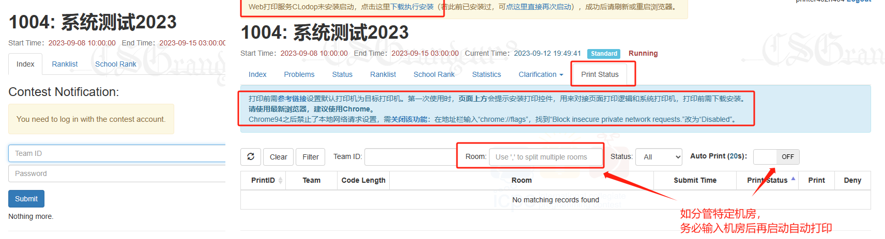


### 1.9 气球管理员（balloon_manager）

主要是全局监管气球发送，可以手动分配任务、撤销一些任务分配等

界面按“A”键切换管理模式

#### 模式1：分配模式（Task Assign Mode）

原则上该模式仅观察、核对，不需要进行操作。气球配送员对气球任务的获取、标记都可以在这个界面看到。

也允许进行分配操作：点击气球任务弹窗，选择将任务分配给特定配送员（baloon_sender）。

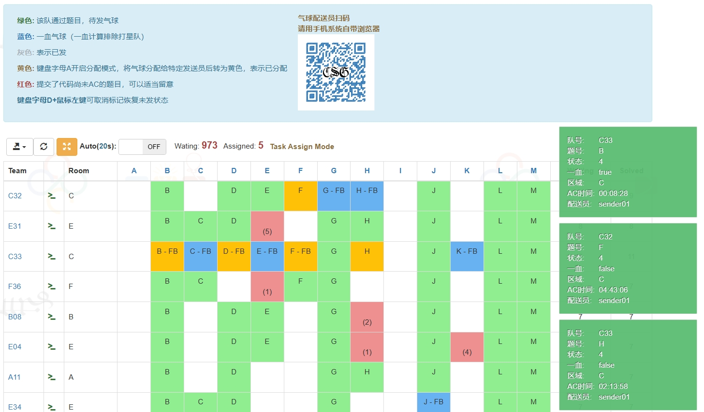


#### 模式2：标记模式（Task Finish Mode）

点击即标记气球任务已下达，配合手写纸条或线上文档任务队列等方式使用。该模式可不需要balloon_sender账号。

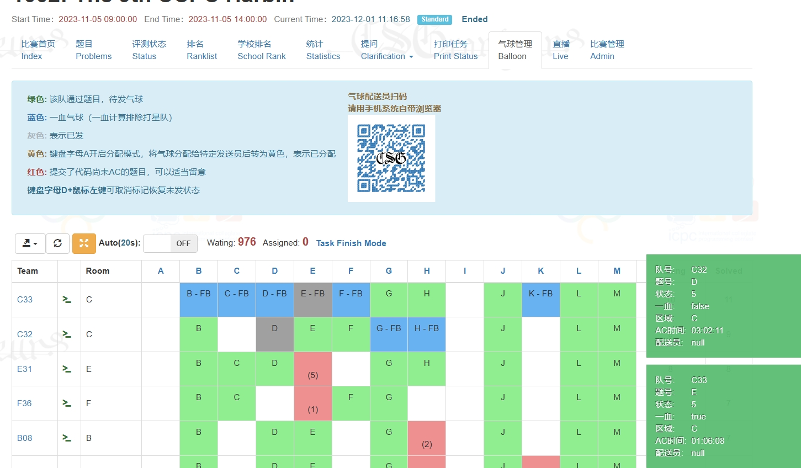


### 1.10 气球配送员（balloon_sender）

使用手机连入赛场wifi，用原生浏览器（不建议用微信、qq内置浏览器）访问OJ，登录balloon_sender账号。

通过该界面拉取自己负责区域的气球任务，发送后双击标记已发放。

双击未发气球的时间列可退还任务。

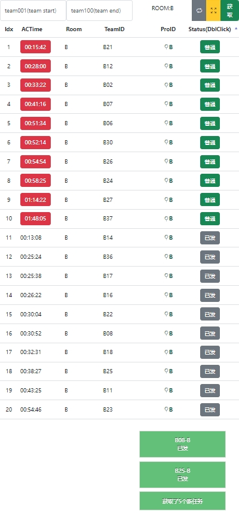


### 1.11 大屏展示

可以用外榜，也可以用内网的Dynamic Rank（在Ranklist界面有个蓝色按钮“Dynamic Rank”）

- 自动刷新：按一下“A”键
- 自动滚屏：按一下“B”键
- 全屏：F11

### 1.12 获奖信息整理

管理员赛后在后台下载获奖信息表（务必确认比赛已结束，status里已经没有未判完的题，然后刷新该页面获取最新数据）

承办方整理获奖信息处理后续事务，这里可以一键导出获奖信息表


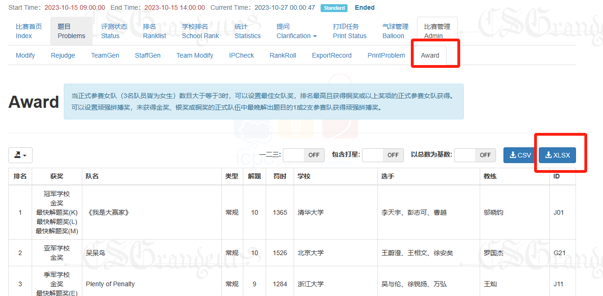

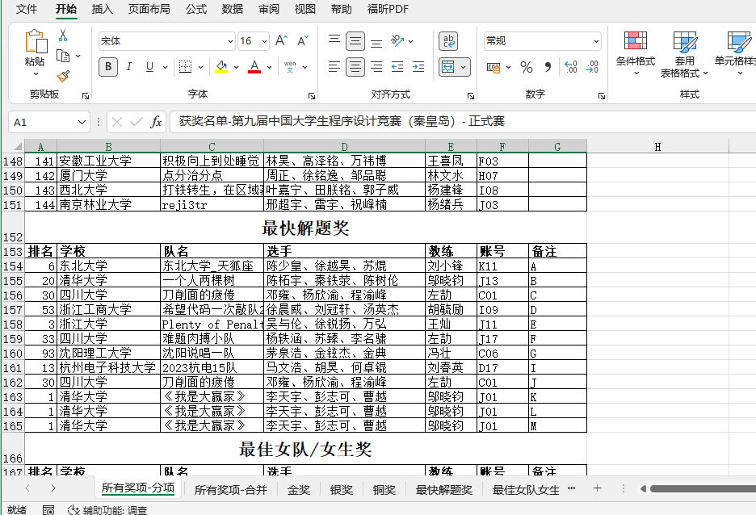

### 1.13 直播

StaffGen中生成 watcher 账号，该账号在菜单中点击“直播Live”，进入直播控制台。

在控制台中可以设置各项参数、菜单的打开关闭。点击“Open Overlay”获得直播token链接。

在obs-studio中添加“浏览器”源，即可将比赛数据信息叠加到直播视频信号中。

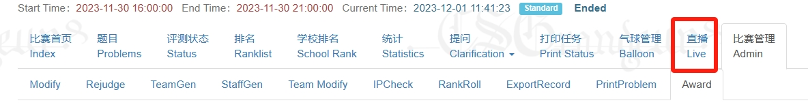

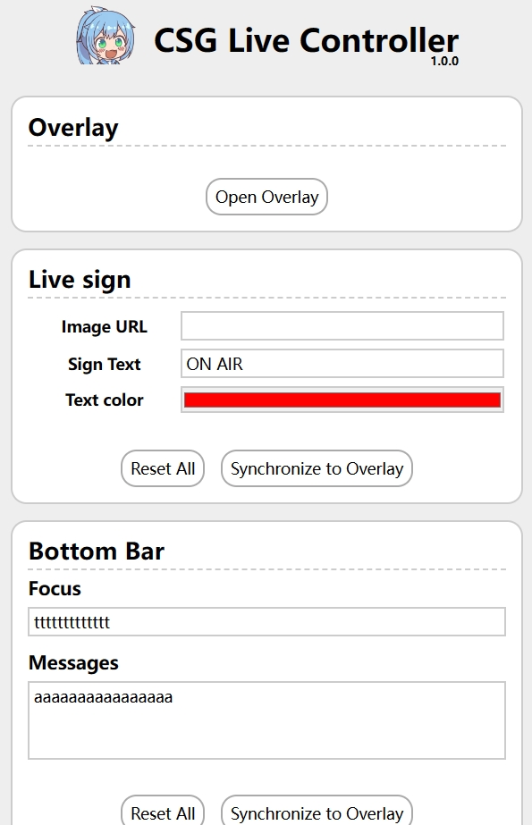

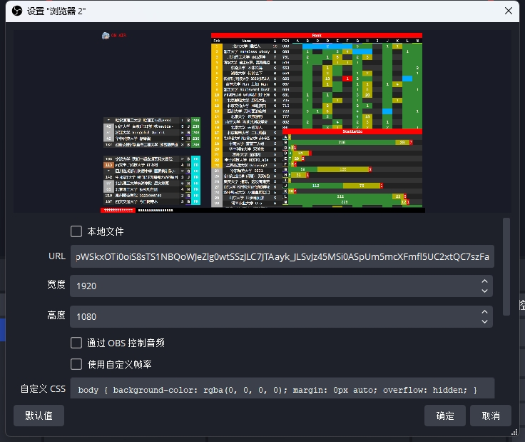


### 1.14 滚榜颁奖

管理员提供一个比赛内的监考员admin账号给承办方，承办方在闭幕式进入该比赛登录该账号，点RankRoll


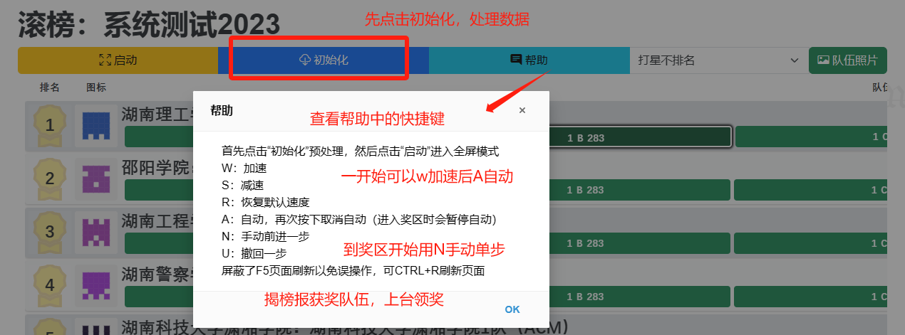

#### 滚榜队伍照片

滚榜页面右上方有一个“队伍照片”按钮，进入队伍照片管理页面

照片有批量和单个两种上传方式

- 单个上传：直接在队伍这一行上传图片文件即可
- 批量上传：准备好所有队伍的.jpg文件，各队文件名为该队登录比赛的账号名，比如team001.jpg，点击“选择文件”后选择所有文件确定，点击批量上传

图片建议宽3:2高，比例有误差没关系OJ会自动裁剪，但别相差太离谱。

**如果滚榜电脑与服务器连接的网络状况不佳，建议提前滚榜一遍用于加载图片到浏览器缓存**

#### 滚榜界面缩放建议

为适配不同屏幕分辨率，点击启动按钮全屏后，通过ctrl+鼠标滚轮，或ctrl+加减号缩放页面，到屏幕内显示12支队伍为宜。

也可根据大屏实际尺寸、保证页面上所有数字完整显示（不会出现省略号）的前提下自行决定。
